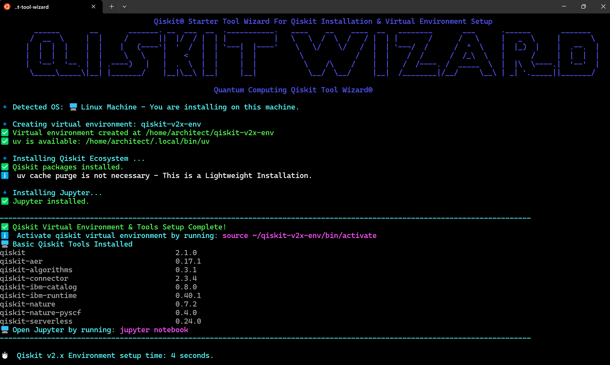

###   ⚛️ Quantum Computing Qiskit Tool Wizard

[](https://github.com/schijioke-uche/quantum-qiskit-v2x-startertool-wizard/actions/workflows/pytest.yml)
[](https://doi.org/10.5281/zenodo.15303640)

######  By: Dr. Jeffrey Chijioke-Uche, IBM Quantum Ambassador & IBM Research
----------------------------------------------------------------------------
The Quantum Computing Qiskit Tool Wizard software is purpose-built for Quantum Application Developers across industries who require a fast, reliable, and standardized way to set up their quantum development environments. The tool automates the creation of a Qiskit compliant virtual environment, tailored specifically for quantum application design, research, and production use cases. It empowers users to seamlessly activate and deactivate the environment on demand, maintaining flexibility while reducing setup friction. With compatibility across Python versions >=v3.9+ , it ensures a broad and future-proof development experience for quantum engineers working on varied hardware and cloud platforms.
<br>   
<br>
Additionally, the Starter Tool integrates support for the Qiskit Connector, a low-code extension that simplifies real-time access to IBM Quantum backends using just the backend keyword. This powerful feature drastically accelerates how developers test, simulate, and deploy quantum circuits by eliminating repetitive setup code and reducing error-prone configuration steps. As a result, quantum developers can focus more on algorithm innovation and application design, achieving higher productivity and shorter time-to-solution cycles — all while operating in a clean, isolated, and production-ready environment optimized for quantum software engineering.

------------------------------------------------------------------------------------

---
#### Output Samples



#### Before you start the installation, you need to be aware of the system requirements:

##### System Requirements

This table outlines the system requirements for running the software. This is **PRODUCTION** documentation.
| Requirement        | Details                                        |
| :----------------- | :--------------------------------------------- |
| **Python Version** | v3.11+ (Minimum Requirement)                   |
| **OS Architecture**| 64-bit                                         |
| **Recommended OS** | Linux (All Distributions)                      |
|                    | macOS (All Distributions)                      |
|                    | Windows OS (WSL)                               |
 
###### Additional Information:
- Python v3.11 as the minimum required but tested on 3.10 & it was a success.
- Operating system with 64bit (32bit OS is not supported by Qiskit)
- Recommended OS:  
   - Linux (All Distributions) 
   - macOS(All Distributions)
   - Windows OS (WSL) -  [See Microsoft Documentation](https://learn.microsoft.com/en-us/windows/wsl/install)
     - To install on Windows OS Native via CMD.exe - You will need Cygwin - [See Cygwin for Windows](https://www.cygwin.com/install.html)

#### Steps to Install Qiskit v2.x Virtual Development Environment

##### Step-1
```sh
git clone https://github.com/schijioke-uche/quantum-computing-qiskit-tool-wizard.git
```

##### Step-2: Change directory
```sh
cd quantum-qiskit-v2x-startertool-wizard
```

##### Step-3: Run the install wizard
```sh
./qiskit-v2x-install-wizard.sh
```

----------------------------------------------

######  Removal of Qiskit Installation & Virtual Environment
```sh
rm -rf  ~/qiskit-v2x-env
```

----------------------------------------------
#####  Author
###### Dr. Jeffrey Chijioke-Uche, IBM Quantum Ambassador
