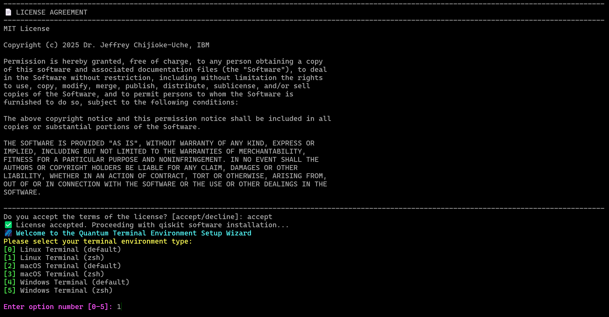
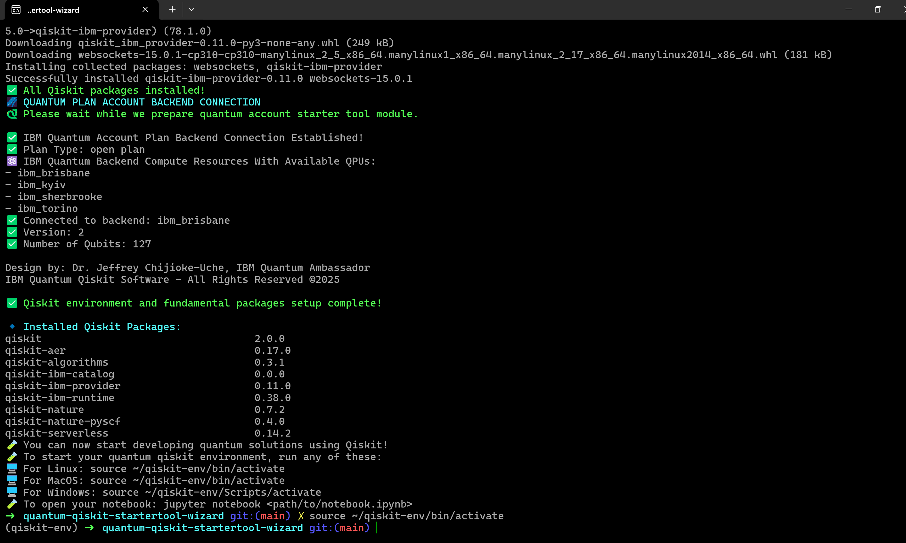

###   ⚛️ Quantum Computing Qiskit Tool Wizard

[](https://github.com/schijioke-uche/quantum-qiskit-v2x-startertool-wizard/actions/workflows/pytest.yml)

######  By: Dr. Jeffrey Chijioke-Uche, IBM Quantum Ambassador & IBM Research
----------------------------------------------------------------------------
The Quantum Computing Qiskit Tool Wizard software is purpose-built for Quantum Application Developers across industries who require a fast, reliable, and standardized way to set up their quantum development environments. The tool automates the creation of a Qiskit compliant virtual environment, tailored specifically for quantum application design, research, and production use cases. It empowers users to seamlessly activate and deactivate the environment on demand, maintaining flexibility while reducing setup friction. With compatibility across Python versions >=v3.9+ , it ensures a broad and future-proof development experience for quantum engineers working on varied hardware and cloud platforms.
<br>
<br>
Additionally, the Starter Tool integrates support for the Qiskit Connector, a low-code extension that simplifies real-time access to IBM Quantum backends using just the backend keyword. This powerful feature drastically accelerates how developers test, simulate, and deploy quantum circuits by eliminating repetitive setup code and reducing error-prone configuration steps. As a result, quantum developers can focus more on algorithm innovation and application design, achieving higher productivity and shorter time-to-solution cycles — all while operating in a clean, isolated, and production-ready environment optimized for quantum software engineering.

----------------------------------------------------------------------------------------------------

### ----------------------------------⚛️Qiskit 1.x vs 2.x Comparison----------------------------------

Below is the comparison of the required packages and components used in virtual environment for Qiskit 1.x versus Qiskit 2.x, along with deprecation notes and migration guidance.

---

#### ✅ Qiskit 1.x vs Qiskit 2.x Package Comparison

| **Package Category**          | **Qiskit 1.x**                  | **Qiskit 2.x**             | **Deprecation Notes**                            |
|------------------------------|----------------------------------|-----------------------------------------|--------------------------------------------------|
| 🧠 Core SDK                  | `qiskit`                         | `qiskit`                          | ✅ Still active                                  |
| 🌀 Aer Simulator             | `qiskit-aer`                     | `qiskit-aer`                    | ✅ Still active                                  |
| ⚛️ Algorithms               | `qiskit-aqua`                    | `qiskit-algorithms`              | ⚠️ `qiskit-aqua` deprecated (migrated to `algorithms`) |
| 🌱 Chemistry                | `qiskit-chemistry`               | `qiskit-nature`                 | ⚠️ `chemistry` fully deprecated → use `nature`   |
| 🌿 Nature + PySCF           | Not separate                     | `qiskit-nature-pyscf`            | ✅ Production PySCF interface                    |
| ☁️ IBM Provider             | `qiskit-ibmq-provider`           | `qiskit-ibm-provider`          | ✅ Rebranded + updated                           |
| 🚀 Runtime                  | Not available                    | `qiskit-ibm-runtime`            | ✅ New in 2.x                                    |
| 🧪 Function Catalog         | Not available                    | `qiskit-ibm-catalog`              | ✅ New in 2.x                                    |
| 🔗 Serverless               | Not available                    | `qiskit-serverless`              | ✅ Cloud-native extension                        |
| 🧪 QuantumInstance          | `qiskit.utils.QuantumInstance`   | ❌ Removed                               | ❌ Deprecated in 2.x — use sessions + primitives |
| 🧪 BaseSampler              | `qiskit.primitives.BaseSampler`  | ❌ Removed                               | ❌ Removed — replaced by `SamplerV2` / `EstimatorV2` |
| 🔐 Env + Config             | Manual `os.environ` usage        | `python-dotenv`, `clean-dotenv`         | ✅ Recommended add-ons                           |
| 📊 Plotting/Display         | `matplotlib`                     | `matplotlib`, `jupyter`                 | ✅ Common requirement                            |
| ⚛️ Backend Discovery        | `qiskit.IBMQ.get_backend()`      | `QiskitRuntimeService().backend(...)`   | ❌ Old methods deprecated in favor of `RuntimeService` |

---

### 🧪 Summary of Key Deprecations in Qiskit 2.x

| Deprecated Component     | Replaced By                              |
|--------------------------|------------------------------------------|
| `qiskit-aqua`            | `qiskit-algorithms`                      |
| `qiskit-chemistry`       | `qiskit-nature`                          |
| `QuantumInstance`        | `Session(...)`, `EstimatorV2`, `SamplerV2` |
| `BaseSampler`, `Sampler` | `SamplerV2`, `EstimatorV2`               |
| Legacy IBMQ Backends     | `QiskitRuntimeService().backend(...)`    |

---

> ✅ Maintained by: Dr. Jeffrey Chijioke-Uche, IBM Quantum Ambassador


### ⚛️ After Qiskit installation, you can build the following Quantum various use cases

| Quantum Algorithm | Description |   Use Case   |
|-------------------|-------------|--------------|
| **Variational Quantum Eigensolver (VQE)** | A hybrid algorithm to approximate the ground state energy of a Hamiltonian. | Quantum chemistry, materials science, and molecular simulations. |
| **Quantum Approximate Optimization Algorithm (QAOA)** | Solves combinatorial optimization problems by mapping them to quantum circuits. | Route optimization, scheduling, and financial portfolio optimization. |
| **Harrow-Hassidim-Lloyd Algorithm (HHL)** | Solves linear systems of equations exponentially faster than classical algorithms in some cases. | Machine learning, numerical simulations, and optimization problems. |
| **Quantum Phase Estimation (QPE)** | Estimates the phase (eigenvalue) of a unitary operator. | Quantum chemistry, Shor's algorithm, and eigenvalue problems. |
| **Quantum Fourier Transform (QFT)** | The quantum analogue of the classical Fourier transform. | Shor’s algorithm, QPE, and signal processing. |
| **Grover's Search Algorithm** | Searches an unsorted database with quadratic speedup over classical algorithms. | Database search, unstructured search problems, and NP-complete problem approximations. |
| **Deutsch-Jozsa Algorithm** | Determines whether a Boolean function is constant or balanced using a single query. | Illustrates quantum speedup and is foundational in quantum algorithm theory. |
| **Bernstein–Vazirani Algorithm** | Finds a hidden binary string using a single evaluation of a function. | Speed-up in cryptographic analysis and quantum machine learning primitives. |
| **Shor’s Algorithm** | Efficiently factors large integers using quantum mechanics. | Cryptography, especially breaking RSA encryption. |
| **Quantum Walks** | Quantum analog of classical random walks, used for algorithmic speed-up. | Graph traversal, network analysis, and search algorithms. |

---
#### Output Samples




#### Before you start the installation, you need to have:
- Python v3.10+ Installed  (Minimum Requirement)
- Operating system with 64bit (32bit OS is not supported by Qiskit)

#### Steps to Install Qiskit v2.x Virtual Development Environment

##### Step-1
```sh
git clone https://github.com/schijioke-uche/quantum-qiskit-startertool-wizard.git
```

##### Step-2: Change directory
```sh
cd quantum-qiskit-v2x-startertool-wizard
```

##### Step-3: Activate the quantum environmental file
```sh
cp .env.tpl .env
```

##### Step-4:  Add the required field values then quit screen
```sh
vi .env
```

##### Step-5: Run the install wizard
```sh
./qiskit-v2x-install-wizard.sh
```

----------------------------------------------

######  Removal of Installation
```sh
./qiskit-v2x-remove-wizard.sh
```

----------------------------------------------
#####  Author
###### Dr. Jeffrey Chijioke-Uche, IBM Quantum Ambassador